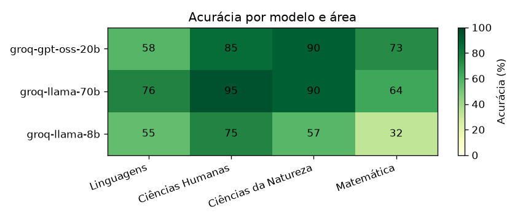
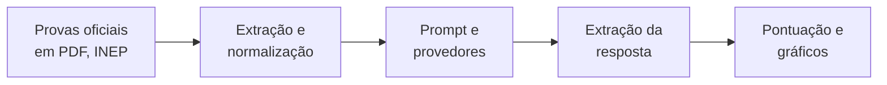
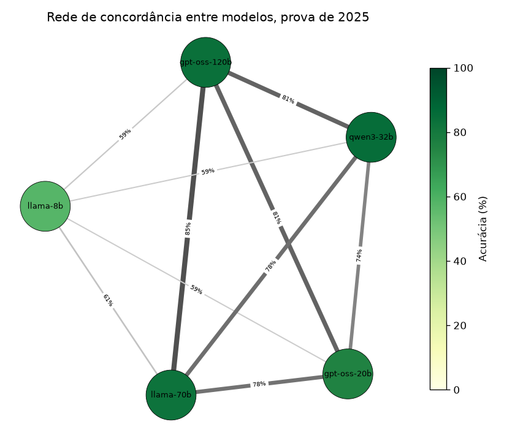
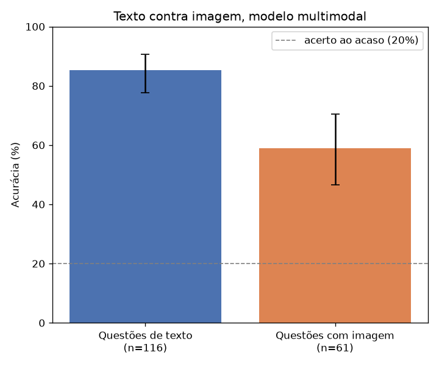
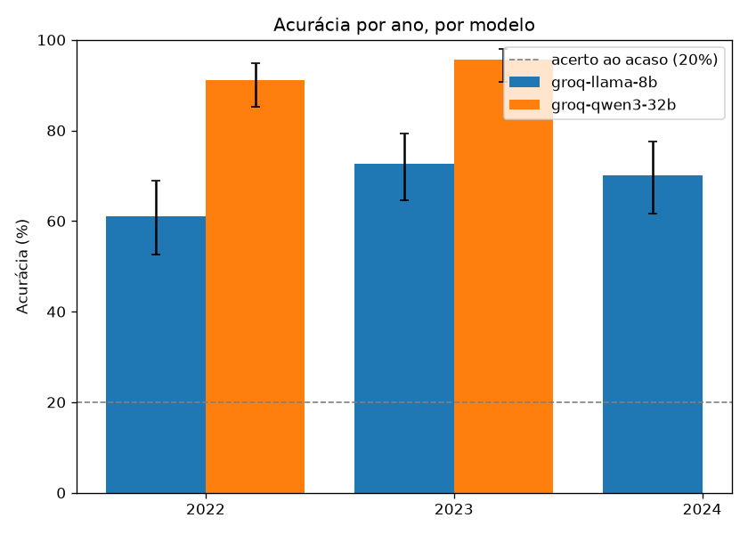
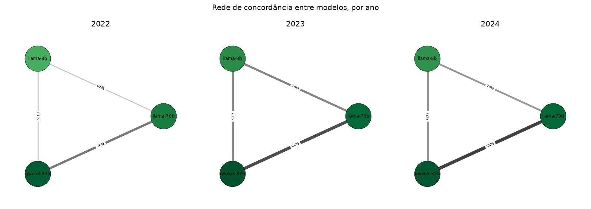

<div align="center" markdown="1">

# enem-llm-benchmark

**Quão bem modelos de linguagem gratuitos resolvem o ENEM, medido do zero.**

Um benchmark que pega as provas oficiais do ENEM, manda vários modelos responderem, e mede a acurácia
por área e por modelo, com os erros comentados e os gráficos gerados a partir dos dados.



[](https://github.com/LucasSpinola/enem-llm-benchmark/actions/workflows/ci.yml)


[Site](https://lucasspinola.github.io/enem-llm-benchmark/) · [Resultados](#resultados) · [Como rodar](#como-rodar) · [Notebook](notebooks/analise.ipynb) · [Erros comentados](docs/erros_comentados.md)

</div>

---

Projeto que mede quão bem modelos de linguagem respondem às questões do ENEM, a prova que mais gente
presta no Brasil. A ideia é direta, eu pego as provas oficiais, mando os modelos responderem, comparo
cada resposta com o gabarito e olho não só o acerto geral, mas também onde cada modelo erra, separando
por área do conhecimento. Ele serve ao mesmo tempo como exercício de engenharia, com extração de PDF,
testes e integração contínua, e como material de pesquisa e portfólio, com método claro e limitações
declaradas.

A análise completa, com os tamanhos de amostra e a discussão dos casos, também está na página
navegável em
[lucasspinola.github.io/enem-llm-benchmark](https://lucasspinola.github.io/enem-llm-benchmark/).

## O que o projeto faz

Para responder quão longe chegam modelos gratuitos numa prova feita para humanos, e em que tipo de
questão eles tropeçam, o trabalho se divide em etapas, cada uma com uma responsabilidade. A primeira
transforma a prova em PDF num conjunto de questões organizadas, a segunda conversa com os modelos e
guarda as respostas em cache, e a terceira extrai a letra escolhida, pontua contra o gabarito e desenha
os gráficos. Cada etapa é um módulo separado, com a lógica pura coberta por testes.



## Resultados

Cinco modelos gratuitos do Groq sobre a prova de 2025, em 116 questões de texto por modelo, com
acurácia geral de 77,1%. Reporto cada taxa com o intervalo de confiança de 95%, e os gráficos trazem
uma linha no acerto ao acaso, 20%, já que são cinco alternativas.

| Modelo | Acurácia | Intervalo de 95% |
|---|---|---|
| Qwen3 32B | 85,3% | 77,8% a 90,6% |
| GPT-OSS 120B | 83,6% | 75,8% a 89,3% |
| Llama 3.3 70B | 82,8% | 74,9% a 88,6% |
| GPT-OSS 20B | 75,9% | 67,3% a 82,7% |
| Llama 3.1 8B | 57,8% | 48,7% a 66,4% |

O modelo pequeno de 8B fica claramente atrás de todos os outros, mas no topo a história é mais sutil,
os intervalos de Qwen3 32B, GPT-OSS 120B e Llama 70B se sobrepõem, então com essa amostra não dá para
cravar quem é o melhor entre eles, e a barra de erro deixa isso explícito. O mapa de calor mostra ainda
que modelo maior não vence sempre, o GPT-OSS de 20B supera o Llama de 70B em matemática.


Por área, a ordem de facilidade foi Ciências Humanas (88,5%), Ciências da Natureza (84,8%), Linguagens
(67,9%) e, a mais difícil, Matemática (62,7%), o que combina com a intuição de quem fez a prova.

Para ver quem responde parecido com quem, montei uma rede em que cada modelo é um nó e a ligação é a
fração de questões em que dois modelos deram a mesma alternativa. Os quatro modelos fortes formam um
bloco que concorda de 74% a 85%, e o Llama 8B fica isolado, concordando só 58% a 61% com os demais, ou
seja, a concordância acompanha a capacidade e não a família.



Para fechar as duas modalidades, rodei também um modelo multimodal, o Llama 4 Scout, nas questões com
figura. O desafio visual aparece com clareza, ele acerta 85,3% das questões de texto mas só 59,0% das
com imagem, uma queda de 26 pontos cujos intervalos nem se sobrepõem, então é uma diferença real,
concentrada nas figuras de matemática e ciências do segundo dia.



Para conferir se o retrato de 2025 se sustenta, estendi o benchmark para 2022, 2023 e 2024 com o
dataset aberto da Maritaca, rodando três modelos que cobrem a faixa de desempenho, Qwen3 32B, Llama
3.3 70B e Llama 3.1 8B. A ordem entre eles se repete em todos os anos, sem cruzamento, o Qwen3 acima de
90%, o Llama 70B entre 78 e 87% e o Llama 8B entre 61 e 73%, então a hierarquia dos modelos não foi um
acaso da prova de um ano. Montar o painel completo exigiu coletar em mais de uma passada, por causa do
teto de tokens por dia do plano gratuito, que aperta nas questões de Matemática, mais longas.



A rede de concordância também se mantém ano a ano, a ligação mais grossa é sempre entre os dois modelos
mais fortes, Llama 70B e Qwen3 32B, e o Llama 8B fica sempre na ponta mais solta.



A discussão detalhada, com os tamanhos de amostra, está na
[página do projeto](https://lucasspinola.github.io/enem-llm-benchmark/) e no notebook
[notebooks/analise.ipynb](notebooks/analise.ipynb).

## De onde vêm as questões

As questões vêm das provas oficiais do ENEM 2025, divulgadas pelo INEP, que são material público. Eu
uso os cadernos de prova e de gabarito em PDF dos dois dias, cobrindo as quatro áreas, Linguagens e
Ciências Humanas no primeiro dia, e Ciências da Natureza e Matemática no segundo. Tirar as questões de
um PDF deu trabalho, porque a prova vem em duas colunas, e uma leitura ingênua embaralha a ordem, então
eu leio o texto coluna a coluna por coordenada. As questões 1 a 5 do primeiro dia têm versão em inglês
e em espanhol, e eu fixei o inglês. As anuladas ficam de fora, por não terem resposta certa. E para as
questões com figura, sobretudo em Matemática, eu recorto a imagem para um arquivo à parte, para os
modelos que enxergam imagem. A procedência e a licença dos dados estão em [data/README.md](data/README.md).

## Como avalio os modelos

Para cada questão, eu monto um prompt com o enunciado e as alternativas, e peço que o modelo explique o
raciocínio e termine com a letra escolhida, num formato fixo. Da resposta crua eu extraio a letra com
uma função tolerante a respostas bagunçadas, e comparo com o gabarito. Os provedores ficam atrás de uma
interface única, então adicionar um modelo é só escrever um adaptador e editar a configuração. Estão
implementados o Gemini, o Groq e o OpenRouter, todos gratuitos. Cada resposta vai para um cache em
disco, então rodar de novo reaproveita o que já foi pedido e não gasta cota, o que ainda deixa o
resultado estável.

## Como rodar

O ambiente é gerenciado com o [uv](https://docs.astral.sh/uv/). Com ele instalado:

```bash
uv sync                        # cria o ambiente e instala tudo
uv run ruff check .            # lint
uv run pytest                  # testes
```

As chaves de API ficam num arquivo `.env`, que nunca é versionado. Copie o `.env.example` para `.env` e
preencha com as suas chaves gratuitas:

```bash
cp .env.example .env
```

Para avaliar os modelos e gerar os gráficos e os erros comentados:

```bash
uv run enembench --so-texto            # roda os modelos do config/models.yaml, salva o CSV
uv run enembench-relatorio             # gera os gráficos e o erros_comentados.md
```

O `enembench` aceita `--limite N` para rodar poucas questões, `--modelos id1,id2` para escolher
modelos, e `--fonte hf` para usar o dataset do Hugging Face em vez do PDF.

## Estrutura do repositório

```
enem-llm-benchmark/
├── README.md             este arquivo
├── config/               lista de modelos a avaliar (models.yaml)
├── data/                 procedência e licença do dataset do ENEM
├── src/enembench/        o código, um módulo por responsabilidade
├── results/              o CSV de resultados versionado
├── docs/                 a página publicada, com os gráficos e os erros comentados
├── notebooks/            a análise exploratória
└── tests/                testes de parsing, pontuação e do runner
```

## Como citar

Lucas Spinola. enem-llm-benchmark, um benchmark de modelos de linguagem nas questões do ENEM. 2025.
Disponível em https://github.com/LucasSpinola/enem-llm-benchmark.

## Licença

O código está sob a licença MIT, descrita em [LICENSE](LICENSE). As provas do ENEM são material público
do INEP, com a procedência registrada em [data/README.md](data/README.md).
