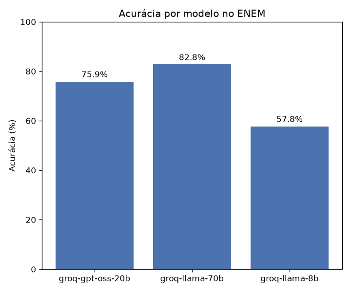

# enem-llm-benchmark

Um benchmark que mede quão bem modelos de linguagem gratuitos respondem às questões do ENEM. A página
com a análise completa está em **https://lucasspinola.github.io/enem-llm-benchmark/**.

A ideia é direta, eu pego as provas oficiais, mando os modelos responderem, comparo cada resposta com
o gabarito e olho não só o acerto geral, mas também onde cada modelo erra, separando por área do
conhecimento. O resultado abaixo é da edição de 2025, com três modelos gratuitos.



## O que o projeto faz

Para responder quão longe chegam modelos gratuitos numa prova feita para humanos, e em que tipo de
questão eles tropeçam, o projeto se divide em três partes, cada uma com uma responsabilidade. A
primeira transforma a prova em PDF num conjunto de questões organizadas, a segunda conversa com os
modelos e guarda as respostas, e a terceira pontua tudo e desenha os gráficos. Cada parte é um módulo
separado, com a lógica pura coberta por testes, o que mantém o código fácil de mexer e de confiar.

## De onde vêm as questões

As questões vêm das provas oficiais do ENEM 2025, divulgadas pelo INEP, que são material público. Eu
uso os cadernos de prova e de gabarito em PDF dos dois dias, cobrindo as quatro áreas, Linguagens e
Ciências Humanas no primeiro dia, e Ciências da Natureza e Matemática no segundo. Tirar as questões
de um PDF deu trabalho, porque a prova vem em duas colunas, e uma leitura ingênua embaralha a ordem,
então eu leio o texto coluna a coluna por coordenada. As questões 1 a 5 do primeiro dia têm versão em
inglês e em espanhol, e eu fixei o inglês. As anuladas ficam de fora, por não terem resposta certa. E
para as questões com figura, sobretudo em Matemática, eu recorto a imagem para um arquivo à parte,
para os modelos que enxergam imagem. A procedência e a licença dos dados estão em
[data/README.md](data/README.md).

## Como avalio os modelos

Para cada questão, eu monto um prompt com o enunciado e as alternativas, e peço que o modelo explique
o raciocínio e termine com a letra escolhida, num formato fixo. Da resposta crua eu extraio a letra
com uma função tolerante a respostas bagunçadas, e comparo com o gabarito. Os provedores ficam atrás
de uma interface única, então adicionar um modelo é só escrever um adaptador e editar a configuração.
Estão implementados o Gemini, o Groq e o OpenRouter, todos gratuitos. Cada resposta vai para um cache
em disco, então rodar de novo reaproveita o que já foi pedido e não gasta cota, o que ainda deixa o
resultado estável.

## Resultados

Três modelos do Groq sobre a prova inteira de 2025, somando 348 respostas de questões de texto, com
acurácia geral de 72,1%.

| Modelo | Acurácia geral |
|---|---|
| Llama 3.3 70B | 82,8% |
| GPT-OSS 20B | 75,9% |
| Llama 3.1 8B | 57,8% |

Por área, a ordem de facilidade foi Ciências Humanas (85,0%), Ciências da Natureza (79,4%), Linguagens
(62,6%) e, bem mais difícil, Matemática (56,1%). O modelo pequeno de 8B ficou atrás dos outros em todas
as áreas, como esperado, mas o achado interessante está no mapa de calor, o GPT-OSS de 20B, menor,
supera o Llama de 70B justamente em Matemática, 73% contra 64%, mesmo perdendo nas demais áreas. Modelo
maior não vence em tudo.


Vale ser franco sobre os limites. As amostras por área são pequenas, então cada taxa tem margem de
erro grande, e diferenças de poucos pontos não devem ser superinterpretadas. Este recorte é só de
questões de texto, já que os modelos textuais não leem imagem, então as questões com figura ficaram de
fora da comparação. A análise detalhada, com os tamanhos de amostra e a discussão dos casos, está na
[página do projeto](https://lucasspinola.github.io/enem-llm-benchmark/) e no notebook
[notebooks/analise.ipynb](notebooks/analise.ipynb).

## Como rodar

O ambiente é gerenciado com o [uv](https://docs.astral.sh/uv/). Com ele instalado:

```bash
uv sync                        # cria o ambiente e instala tudo
uv run ruff check .            # lint
uv run pytest                  # testes
```

As chaves de API ficam num arquivo `.env`, que nunca é versionado. Copie o `.env.example` para `.env`
e preencha com as suas chaves gratuitas:

```bash
cp .env.example .env
```

Para avaliar os modelos e gerar os gráficos e os erros comentados:

```bash
uv run enembench --so-texto            # roda os modelos do config/models.yaml, salva o CSV
uv run enembench-relatorio             # gera os gráficos e o erros_comentados.md
```

O `enembench` aceita `--limite N` para rodar poucas questões, `--modelos id1,id2` para escolher
modelos, e `--fonte hf` para usar o dataset do Hugging Face em vez do PDF.

## Estrutura

```
config/          lista de modelos a avaliar (models.yaml)
data/            procedência e licença do dataset do ENEM
src/enembench/   o código do benchmark, um módulo por responsabilidade
results/         o CSV de resultados versionado
docs/            a página publicada, com os gráficos e os erros comentados
notebooks/       a análise exploratória
tests/           testes de parsing, pontuação e do runner
```

## Como citar

Lucas Spinola. enem-llm-benchmark, um benchmark de modelos de linguagem nas questões do ENEM. 2025.
Disponível em https://github.com/LucasSpinola/enem-llm-benchmark.

## Licença

Distribuído sob a licença MIT. Veja o arquivo [LICENSE](LICENSE).
