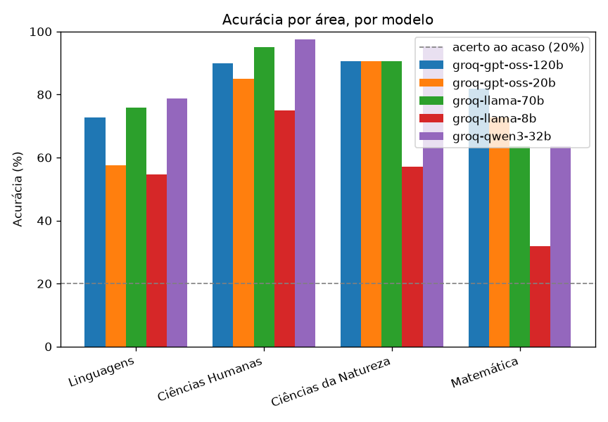

# enem-llm-benchmark

[](https://github.com/LucasSpinola/enem-llm-benchmark/actions/workflows/ci.yml)
[](https://github.com/LucasSpinola/enem-llm-benchmark/blob/main/LICENSE)


Este é um projeto que eu montei para medir quão bem alguns modelos de linguagem respondem às questões
do ENEM, a prova que mais gente presta no Brasil. A ideia central é simples, eu pego as provas
oficiais, mando os modelos responderem, comparo cada resposta com o gabarito e olho não só o acerto
geral, mas também onde cada modelo erra, separando por área do conhecimento. O resultado abaixo é da
edição de 2025, com cinco modelos gratuitos, e já trouxe achados que eu não esperava de início.


**Em resumo, o que este trabalho mostra:**

- Cinco modelos gratuitos do Groq na prova de 2025, com acurácia geral de 77%, e Qwen3 32B, GPT-OSS
  120B e Llama 70B tecnicamente empatados no topo, dentro da margem de erro.
- Matemática é a área mais difícil para todos, e as questões com imagem derrubam o modelo multimodal
  de 85% para 59% de acerto.
- A ordem entre os modelos se repete de 2022 a 2024, então o ranking não foi um acaso da prova de um ano.
- A concordância entre os modelos acompanha a capacidade, o modelo mais fraco se descola do grupo na
  hora de responder.

## O que eu quis responder

A pergunta que guia o trabalho é quão longe chegam modelos gratuitos, desses que qualquer pessoa roda
com uma chave de API sem pagar nada, numa prova feita para humanos, e em que tipo de questão eles
tropeçam. Em vez de ficar só com a nota final, que esconde muita coisa, eu quis um retrato por área,
porque é aí que dá para perceber, por exemplo, se um modelo vai bem em interpretação de texto mas
desanda no raciocínio matemático. Para isso o projeto precisou de três peças, uma que transforma a
prova em PDF num conjunto de questões organizadas, uma que conversa com os modelos e guarda as
respostas, e uma que pontua tudo e desenha os gráficos.

## De onde vêm as questões

As questões vêm das provas oficiais do ENEM 2025, divulgadas pelo INEP, que são material público.
Eu uso os cadernos de prova e de gabarito em PDF dos dois dias, o primeiro com Linguagens e Ciências
Humanas, e o segundo com Ciências da Natureza e Matemática, cobrindo as quatro áreas da prova. Tirar
as questões de um PDF, no entanto, deu bastante trabalho, porque a prova vem em duas colunas, e uma
leitura ingênua embaralha a ordem das questões. Eu acabei lendo o texto coluna a coluna por
coordenada, casando cada cabeçalho com a questão certa.

Algumas decisões tiveram que ser registradas com cuidado, para o resultado ser honesto. As questões
1 a 5 do primeiro dia têm versão em inglês e em espanhol, e eu fixei o inglês. As questões anuladas,
que o gabarito do segundo dia marca como tal, ficam de fora, porque não há resposta certa para
pontuar. E muitas questões têm figura, sobretudo em Matemática, então, para os modelos que enxergam
imagem, eu recorto a figura da questão para um arquivo à parte, distinguindo um gráfico de verdade da
moldura de uma simples caixa de texto pela quantidade de texto dentro da região. Toda a procedência e
a licença dos dados estão documentadas no repositório.

## Como eu avalio os modelos

Para cada questão, eu monto um prompt que apresenta o enunciado e as cinco alternativas, e peço que o
modelo explique o raciocínio passo a passo e termine escrevendo a letra escolhida num formato fixo.
Guardar o raciocínio é útil, porque é dele que sai a coletânea de erros comentados, que mostra como o
modelo pensou quando errou. Da resposta crua eu extraio a letra com uma função tolerante, que aguenta
respostas bagunçadas, e comparo com o gabarito.

Os provedores ficam todos atrás de uma interface única, então adicionar um modelo novo é só escrever
um pequeno adaptador e apontar um arquivo de configuração, sem mexer no núcleo. Hoje estão
implementados o Google Gemini, o Groq e o OpenRouter, todos com plano gratuito. Cada resposta vai
para um cache em disco, com chave derivada do modelo, da questão e do prompt, de modo que rodar de
novo reaproveita o que já foi pedido e não gasta cota à toa, o que também torna o resultado estável.

## Os resultados

A rodada que apresento aqui usou cinco modelos do Groq sobre a prova de 2025, em 116 questões de
texto por modelo, com acurácia geral de 77,1%. Reporto cada taxa com o intervalo de confiança de 95%,
calculado pelo método de Wilson, que se comporta melhor em amostras pequenas, e os gráficos trazem uma
linha no acerto ao acaso, 20%, já que são cinco alternativas.

| Modelo | Acurácia | Intervalo de 95% |
|---|---|---|
| Qwen3 32B | 85,3% | 77,8% a 90,6% |
| GPT-OSS 120B | 83,6% | 75,8% a 89,3% |
| Llama 3.3 70B | 82,8% | 74,9% a 88,6% |
| GPT-OSS 20B | 75,9% | 67,3% a 82,7% |
| Llama 3.1 8B | 57,8% | 48,7% a 66,4% |

O modelo pequeno de 8 bilhões de parâmetros fica claramente atrás de todos os outros. No topo, porém,
a leitura precisa de cuidado, os intervalos de Qwen3 32B, GPT-OSS 120B e Llama 70B se sobrepõem, então
com essa amostra eu não consigo afirmar quem é o melhor entre eles, e foi por isso que coloquei as
barras de erro, para não vender uma diferença que pode ser só ruído. O mapa de calor lá do começo traz
ainda outra surpresa, o GPT-OSS de 20 bilhões, que é menor, supera o Llama de 70 bilhões justamente em
Matemática, mesmo perdendo nas demais áreas, então modelo maior não vence em tudo.



Por área, a ordem de facilidade foi Ciências Humanas (88,5%), Ciências da Natureza (84,8%), Linguagens
(67,9%) e, a mais difícil, Matemática (62,7%), o que combina com a intuição de quem já fez a prova.

## Quem responde parecido com quem

Olhar só a nota esconde uma pergunta interessante, será que os modelos erram e acertam nas mesmas
questões, ou cada um tem o seu jeito de responder. Para ver isso, montei uma rede em que cada modelo é
um nó, e a ligação entre dois deles é a fração de questões em que deram exatamente a mesma alternativa,
não importa se certa ou errada. No layout de força, quanto mais dois modelos concordam, mais perto e
mais grossa fica a ligação, e a cor do nó é a acurácia do modelo.


O desenho deixa claro um ponto que não saltava aos olhos nas barras. Os quatro modelos mais fortes
formam um bloco bem amarrado, concordando entre si de 74% a 85% das vezes, enquanto o Llama 8B fica
isolado num canto, concordando só 58% a 61% com os demais. Ou seja, a concordância acompanha a
capacidade, não a família, o GPT-OSS de 120 bilhões responde mais parecido com o Llama 70B do que com o
seu irmão de 20 bilhões. Faz sentido, modelos que sabem a resposta convergem para a mesma letra certa, e
o modelo que erra mais é justamente o que se descola do grupo.

## Texto contra imagem

Para fechar as duas modalidades, que era um objetivo do projeto, eu rodei um modelo multimodal, o
Llama 4 Scout, também nas questões com figura. O desafio visual aparece com força, o mesmo modelo
acerta 85,3% das questões de texto mas só 59,0% das que dependem de imagem, uma queda de 26 pontos cujos
intervalos nem chegam a se sobrepor, o que indica uma diferença real, concentrada nas figuras de
matemática e ciências do segundo dia.


## O ranking se mantém ao longo dos anos

Para checar se o que vi em 2025 não foi sorte de uma prova específica, estendi o benchmark para 2022,
2023 e 2024, usando o dataset aberto da Maritaca. Rodei três modelos que cobrem bem a faixa de
desempenho, o Qwen3 32B no topo, o Llama 3.3 70B no meio e o Llama 3.1 8B na base. A ordem entre eles
se repete em todos os anos, sem cruzamento, o Qwen3 fica acima de 90%, o Llama 70B na casa dos 78 a
87%, e o Llama 8B nos 61 a 73%, e os intervalos do topo e da base nunca chegam a se tocar. Em outras
palavras, o retrato de 2025 não é um acaso da prova daquele ano, a hierarquia entre os modelos é
estável ao longo do tempo.


Montar esse painel completo, com os três modelos nos três anos, exigiu paciência com o plano gratuito.
O Groq conta um teto de tokens por dia para cada modelo, e as questões de Matemática, que são mais
longas, esbarram nesse teto, então precisei coletar em mais de uma passada, à medida que a cota se
renovava. Como o cache guarda tudo o que já foi respondido, isso não custou cota nem dinheiro, só
tempo, mas é um lembrete concreto do que dá para medir usando só as camadas gratuitas dos provedores.

## O que ainda não está perfeito

Vale ser franco sobre os limites, porque eles importam na hora de ler os números. As amostras por área
ainda são modestas, na casa de algumas dezenas a poucas centenas de questões, e os intervalos de
confiança existem justamente para deixar essa incerteza à vista. A comparação principal usa questões de
texto, porque os modelos puramente textuais não leem imagem, e o recorte multimodal acima fica por
conta de um único modelo. Há ainda um punhado de questões de Matemática em que as alternativas são
fórmulas em imagem, que a extração de texto não consegue ler, e essas saem com alternativas vazias. Por
fim, os planos gratuitos impõem limites de cota e de taxa, então uma rodada inteira pede atenção a esses
limites, e neste trabalho o Groq foi o provedor mais estável.

## Como reproduzir

O ambiente é gerenciado com o [uv](https://docs.astral.sh/uv/). Depois de clonar o repositório e
colocar as chaves gratuitas num arquivo `.env`, a partir do `.env.example`, basta avaliar os modelos
e gerar os relatórios:

```bash
uv sync
uv run enembench --so-texto       # avalia os modelos do config e salva o CSV
uv run enembench-relatorio        # gera os gráficos e os erros comentados
```

O CSV com os resultados está versionado no repositório, então o notebook de análise em
[notebooks/analise.ipynb](https://github.com/LucasSpinola/enem-llm-benchmark/blob/main/notebooks/analise.ipynb)
roda direto e reproduz cada gráfico desta página.

## Os erros comentados

A parte que mais rende para discutir é a coletânea de [erros comentados](erros_comentados.md), que
junta as questões erradas com o raciocínio que cada modelo deu. É lendo esses casos que dá para
entender se o modelo não sabia o conteúdo, se foi mal na conta, ou se a própria extração da questão
atrapalhou.

---

O código está no [repositório](https://github.com/LucasSpinola/enem-llm-benchmark), com testes e
integração contínua. Feito por Lucas Spinola, sob licença MIT.
